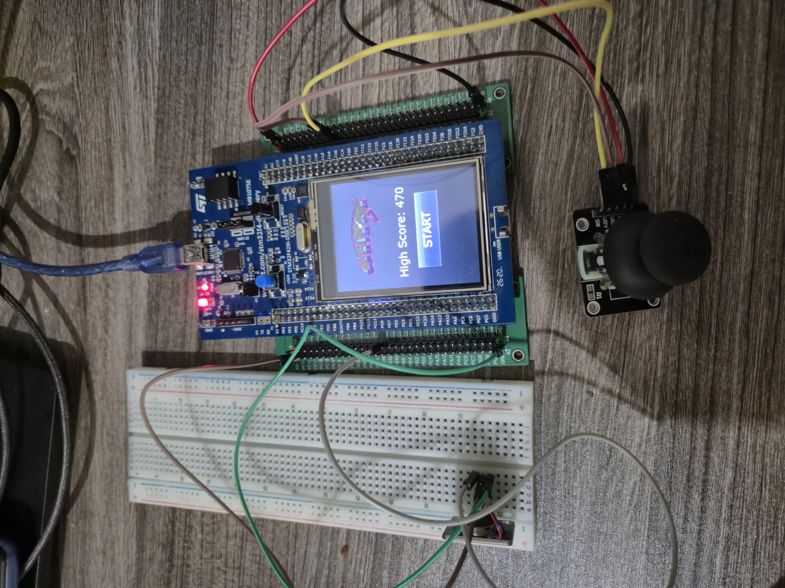

# BÁO CÁO BÀI TẬP LỚN HỆ NHÚNG: GAME GALAGA

## GIỚI THIỆU

__Đề bài/Mục tiêu sản phẩm__: Mô phỏng trò chơi 2D Galaga, sử dụng nút bấm hoặc joystick để điều khiển.

__Hướng tiếp cận__: Giao diện đồ họa được thiết kế qua TouchGFX. Người chơi thao tác điều khiển phi thuyền thông qua module Joystick. Các sự kiện trong game (va chạm, mất mạng) sẽ được phản hồi trực tiếp qua module rung (Vibration) và tín hiệu đèn LED (GPIO).

__Sản phẩm:__
1. Tính năng điều khiển phi thuyền: Di chuyển linh hoạt bằng Joystick, tự động bắn đạn.
2. Tính năng sinh quái: Sinh quái theo đội hình, di chuyển xuyên màn hình, xả đạn ngẫu nhiên và hạ độ cao theo chu kỳ.
3. Tính năng Vật phẩm & Điểm số: Rơi trái tim hồi mạng ngẫu nhiên, hệ thống đếm điểm.
4. Tính năng Quản lý Màn chơi: Chuyển đổi 5 cấp độ khó khác nhau với số quái tăng dần kèm hệ thống thay đổi hình nền tự động.
5. Tính năng Lưu điểm cao nhất: Ghi và nạp Điểm cao nhất (High Score) vào bộ nhớ Flash.

- Ảnh chụp minh họa:\
  
## KẾT QUẢ

[Video Demo Gameplay](https://drive.google.com/file/d/1hAW2FNl-EJhviSv6gcCtoFQ6vYRCmpje/view?usp=sharing)
## TÁC GIẢ

- Tên nhóm: VIT
- Thành viên trong nhóm:

  | STT | Họ tên | MSSV | Công việc |
  | --: | :-- | :-- | :-- |
  | 1 | Vũ Đức Anh | 20225257 | Thiết kế Core Game Logic, quản lý vòng lặp RTOS và thuật toán va chạm vật lý. |
  | 2 | Vũ Thùy Dương | 20235315 | Thiết kế giao diện UI/UX trên TouchGFX, xử lý đồ họa và quản lý chuyển màn. |
  | 3 | Đoàn Thanh Hải | 20235320 | Xây dựng cấu trúc Hướng đối tượng (Entity, Enemy, Ship, Bullet) và cơ chế bắn đạn ngẫu nhiên. |
  | 4 | Trịnh Thiên Lam | 20235359 | Xử lý tín hiệu Input từ Joystick qua Message Queue, logic Vật phẩm rơi. |
  | 5 | Đoàn Diệu Linh | 20225141 | Quản lý bộ nhớ Flash (High Score) và cấu hình Output GPIO cho module rung (Vibration) & LED cảnh báo. |

## MÔI TRƯỜNG HOẠT ĐỘNG

- **Module CPU/Dev kit:** STM32F429I-DISC (cụ thể STM32F429ZIT6).

__Bill of materials__
  | STT | Tên linh kiện | Ý nghĩa |
  | :-- | :-- | :-- |
  | 1 | Board STM32F429I-DISC | Xử lý trung tâm, chạy hệ điều hành FreeRTOS và luồng Game |
  | 2 | Module Joystick | Tương tác điều khiển phi thuyền di chuyển theo 4 hướng |
  | 3 | Motor Rung (Vibration) | Tạo hiệu ứng rung khi phi thuyền trúng đạn |

## SƠ ĐỒ SCHEMATIC

_Bảng mô tả kết nối các linh kiện:_ 

|STM32F429|Joystick|Motor rung|
|--|--|--|
|3.3V|VCC||
|5V||VCC|
|GND|GND|GND|
|PA1|VRx|
|PA2|VRy|
|PG13||IN|

## TÍCH HỢP HỆ THỐNG
- Thành phần phần cứng:

| Thành phần | Vai trò                                                      |
| ---------- | ------------------------------------------------------------ |
| STM32F429  | Xử lý logic trò chơi, đọc tính hiệu joystick, kích hoạt module rung/LED qua GPIO, tạo số ngẫu nhiên |
| Joystick   | Điều khiển tàu (4 hướng) |
| Motor rung | Tạo cảm giác rung khi bị tàu bị va chạm |

- Thành phần phần mềm:

| Thành phần | Vai trò                                                    |
| ---------- | ---------------------------------------------------------- |
| Phần mềm Backend(Core) | Xử lý logic vật lý, logic tính toán, cập nhật tọa độ và kiểm tra va chạm |
| Phần mềm Frontend(UI) | Qua ứng dụng TouchGFX, Cập nhật trạng thái điểm ảnh các vật thể, quản lý thanh máu và render hình nền theo màn chơi. |


## ĐẶC TẢ HÀM

- Giải thích một số hàm quan trọng:

### 1. Hàm quản lý Quái vật

```cpp
/**
 * Cập nhật trạng thái và vị trí của toàn bộ đội hình quái vật trên màn hình.
 * Hàm quản lý việc di chuyển tịnh tiến sang phải, cơ chế đi xuyên màn hình (wrap-around)
 * khi vượt quá biên phải (X >= 240) và tự động hạ độ cao cả đội hình xuống một hàng (+15 pixel)
 * dựa trên một bộ đếm thời gian độc lập (Timer-based) chạy theo thời gian thực.
 * @param  dt  Delta time - khoảng thời gian giữa hai lần cập nhật game. (khóa bằng 1 ở chuẩn 60 FPS)
 */
void updateEnemy(uint8_t dt) {
  //giới hạn độ khó tối đa là 5
    int effectiveRound = (currentRound > 5) ? 5 : currentRound;
    static int dropTimer = 0;

    // 1. Khởi tạo đội hình quái
    if (!isWaveInitialized) {
        int numEnemies = effectiveRound * 6;
        if (numEnemies > MAX_ENEMY) numEnemies = MAX_ENEMY;

        int cols = 6;
        int startSpeed = (currentRound >= 3) ? 2 : 1;//tăng độ khó từ round 3
        enemyMoveDirection = 1;//đo sang phải -1 thì đi sang trái (kiểu tọa độ)

        for (int i = 0; i < numEnemies && i < MAX_ENEMY; i++) {
            int row = i / cols;
            int col = i % cols;
            uint16_t startX = 10 + col * 35;
            uint16_t startY = 20 + row * 30;

            enemy[i].updateCoordinate(startX, startY);//cập nhật vị trí
            enemy[i].updateVelocity(enemyMoveDirection * startSpeed, 0);//gán vận tốc
            enemy[i].updateDisplayStatus(SHOULD_SHOW);//đánh dấu sẽ xuất hiện để tí khởi tạo cả đoàn quái cùng lúc
        }
        isWaveInitialized = true;
        dropTimer = 0;
    }

    // 2. Di chuyển ngang & Đi xuyên màn hình (Wrap-around)
    for (int i = 0; i < MAX_ENEMY; i++) {
        if (enemy[i].displayStatus == IS_SHOWN || enemy[i].displayStatus == SHOULD_SHOW) {
            enemy[i].update(dt);
            if (enemy[i].coordinateX >= 240) {
                enemy[i].updateCoordinate(-32, enemy[i].coordinateY);//vượt cạnh phải thì update vị trí ở bên trái
            }
        }
    }

    // 3. Cơ chế hạ độ cao theo thời gian
    dropTimer++;
    int dropThreshold = 200 - (effectiveRound * 20);
    if (dropThreshold < 80) dropThreshold = 80;//giới hạn tốc độ rơi

    if (dropTimer >= dropThreshold) {
        dropTimer = 0;
        for (int i = 0; i < MAX_ENEMY; i++) {
            if (enemy[i].displayStatus == IS_SHOWN || enemy[i].displayStatus == SHOULD_SHOW) {
                enemy[i].updateCoordinate(enemy[i].coordinateX, enemy[i].coordinateY + 15);
                if (enemy[i].coordinateY > 280) {
                     enemy[i].updateCoordinate(enemy[i].coordinateX, -32);
                }
            }
        }
    }
}
```
### 2. Hàm xử lý va chạm và sinh vật phẩm ngẫu nhiên
```cpp
/**
 * Kiểm tra va chạm giữa Đạn tàu và Quái vật, đồng thời xử lý logic rơi vật phẩm (Trái tim - Mạng).
 * Sử dụng thuật toán hộp giới hạn căn chỉnh theo trục (AABB - Axis-Aligned Bounding Box) cho va chạm 
 * và Timer phần cứng (HAL_GetTick) để tính toán tỷ lệ rơi ngẫu nhiên (RNG).
 */

/* KIỂM TRA VA CHẠM ĐẠN TÀU VÀ QUÁI */
for (int i = 0; i < MAX_ENEMY; i++) {
    if (enemy[i].displayStatus != IS_SHOWN) continue;
    for (int j = 0; j < MAX_BULLET; j++) {
        if (shipBullet[j].displayStatus != IS_SHOWN) continue;
        
        // Thuật toán va chạm kiểm tra 2 hình chữ nhật có giao nhau không
        if (Entity::isCollide(enemy[i], shipBullet[j])) {
          //trúng thì ẩn quái và ẩn đạn đồng thời +5 điểm
            enemy[i].updateDisplayStatus(SHOULD_HIDE);
            shipBullet[j].updateDisplayStatus(SHOULD_HIDE);
            gameInstance.updateScore(5);

            // Tính năng rơi vật phẩm: 5% tỷ lệ rơi ra trái tim dựa trên True RNG từ Tick hệ thống
            if (!isHeartDropping && (HAL_GetTick() % 100 < 5)) {
                heartDropX = enemy[i].coordinateX;
                heartDropY = enemy[i].coordinateY;
                isHeartDropping = true;
            }
            break;
        }
    }
}

if (isHeartDropping) {
    heartDropY += 2; // Tốc độ rơi tự do của vật phẩm

    if (heartDropY > 320) {
        // Thu hồi vật phẩm nếu rơi ra khỏi màn hình để giải phóng tài nguyên
        isHeartDropping = false;
        heartDropX = -100;
        heartDropY = -100;
    } else {
        int sX = gameInstance.ship.coordinateX;
        int sY = gameInstance.ship.coordinateY;

        // Thuật toán va chạm giữa Vật phẩm và Tàu người chơi
        if (heartDropX < sX + 32 && heartDropX + 32 > sX &&
            heartDropY < sY + 32 && heartDropY + 32 > sY) {

            if (gameInstance.ship.lives < 3) {
                gameInstance.ship.lives++;

                uint8_t msg = 3;
                osMessageQueuePut(Queue5Handle, &msg, 0, 0);
            }

            // Thu hồi vật phẩm sau khi tương tác thành công
            isHeartDropping = false;
            heartDropX = -100;
            heartDropY = -100;
        }
    }
}
```
